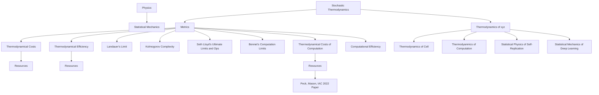
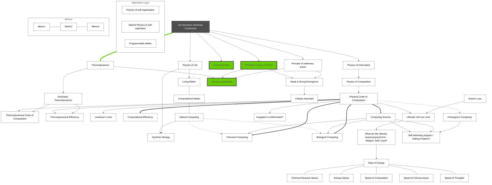
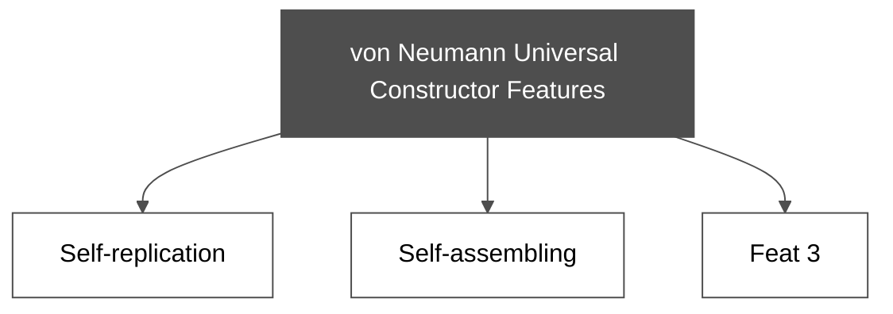
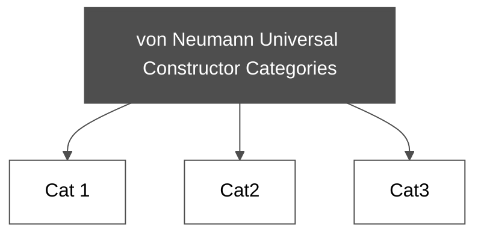

# Markdown toolbox

 ## Normal Box, different colors

‭Some Text, some <mark style="background-color: ‬#d8d8d8‭">Highlighted text</mark> ‬

<!-- This content will not appear in the rendered Markdown -->
 


Biological systems -> are goal-directed
                         -> <mark>survive</mark>
                         -> <mark>reproduce</mark>



I am an error message



I am a info message



I am a warning message


Aesthetic Color Schemes: https://hexcolorpedia.com/color/4e4e4e/

Grey F8F8F8
Grey #d8d8d8

#### Content
[TOC]

####Overview

##### Resources
- [ ] Book
- [ ] dfasd
- [ ] adsf
- [ ]

**Note:**
- Make a difference between concepts and grouped disciplines (physic of life)
- Color (define classes) the disciples, groupes, concepts
- subgraphs pg 186
- Edge color
- Node color
- Subgraph color

# Universal Constructor Categories
Note:
- Definition of "Universal Constructor
- Is "self-replication a feature of Universal Constructor?"
- UC categories or self-replication?
-

#

