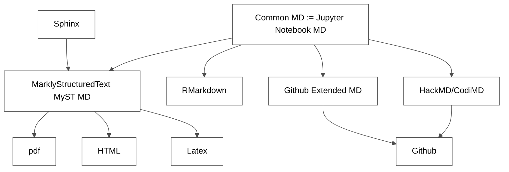
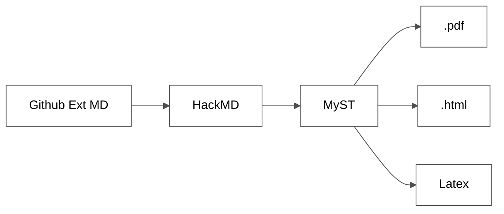

# Chapter 1 - Open Research One-Pager
:::warning
⚠️ May 2022 -  This repository is under construction - work in progress.
:::

###### tags: `Tutorials`

## Tutorials
### Open Science - General
Start with the following tutorials:
- Start with that one - that's a great summary: **[Reproducibility Starts from You Today](https://www.sciencedirect.com/science/article/pii/S2666389920301331)**
- **The Turing Way** -> [Turing Way Tutorial](https://the-turing-way.netlify.app/welcome)
- **Fair Cookbook** -> [Elexir Europe - Fair Cookbook](https://faircookbook.elixir-europe.org)
- **Open Science** -> [Open Science Foundation](https://osf.io) and [Open Science Project](https://openscience.org/what-exactly-is-open-science/) and [Opening Science](http://www.openingscience.org/get-the-book/) and [Open Science Training Book](https://github.com/Open-Science-Training-Handbook/Open-Science-Training-Handbook_EN/tree/1.0)

### Open Science - Special
- **Fair Sharing** -> [Fair Sharing Data Management Plans](https://fairsharing.org)
- **Data Management Plan** [Elexir Europe Tutorial](https://rdmkit.elixir-europe.org/data_management_plan.html)
- **Research Data Sharing Tools**
    * [Figshare](https://figshare.com)
    * [Zenodo](https://zenodo.org/record/5103176#.YnZ5Xy8RpUk) and an [ZenodoExample](https://zenodo.org/record/6470904#.YnZlly8RpUm)

### Open Science Teaching and Workshops
- **[The Carpentry Community](https://carpentries.org)** has a great [Workshop Template](https://github.com/malvikasharan/2020-02-10-turing) which looks like [this](https://carpentries.github.io/lesson-example/) or [this](https://alan-turing-institute.github.io/2020-02-10-turing/)(and here the [Repo](https://github.com/malvikasharan/2020-02-10-SwC-Turing))
- There are also Tutorials on [How to create a lesson](https://github.com/malvikasharan/lesson-example) and [here](https://docs.carpentries.org/topic_folders/lesson_development/curriculum_advisory_committees.html#term-lengths-recruitment-and-onboarding)

### Open Science Project Management
- Besides the above mentioned [Turing Way and Fair](#Open-Science---General) Tutorials [this one](https://github.com/malvikasharan/WhitakerLabProjectManagement) might also help.
- **[Project Boards](https://docs.github.com/en/issues/organizing-your-work-with-project-boards/managing-project-boards/about-project-boards)** and [Github Collaboration](http://mozillascience.github.io/working-open-workshop/github_for_collaboration/) and [Fair Cookboook Collaboration](https://faircookbook.elixir-europe.org/content/recipes/afterword/contributing.html)
  * [Project Tags and Labels](https://github.com/FAIRplus/the-fair-cookbook/labels)
  * [Github Repo - Research paper example from Ocean Transport Research](https://github.com/ocean-transport/3D_tracer_inversion)
  * [Shablona Project Skeleton](https://github.com/uwescience/shablona)
  * Of course, the obvious [Cookiecutter Data Science Template](https://github.com/drivendata/cookiecutter-data-science) with some explanation [here](https://drivendata.github.io/cookiecutter-data-science/#contributing)
  
- **Organizing in Sprints**
     * Example from the [Ocean Transport Research](https://github.com/ocean-transport/science-together:)
     * 

### Open Science Workflow
- **A tutorial from [TU Hamburg](https://www3.tuhh.de/itbh/kollaborieren-in-forschung-und-lehre/jupyter-notebook-und-jupyterlab.html)** figures the workflow as following:
 

### Open Science Best Practices
- **[Best Practices Paper from the Carpentry Team](https://journals.plos.org/ploscompbiol/article/file?id=10.1371/journal.pcbi.1005510&type=printable)**
- **[The Good Research Code Handbook](https://goodresearch.dev/index.html)** from Patrick Mineault
- **[Best Practices and Python Tutorial](https://github.com/sparks-baird/auto-paper)** from Sterling Baird and Tayler Sparks:

### Markdown Tools
- **[Table Generator](https://www.tablesgenerator.com/#latex)**
- **[Mathpix Snipping](https://github.com/sparks-baird/auto-paper/blob/main/mathpix.com)**
- **[extract numerical data from plot images](https://apps.automeris.io/wpd/)**

#### Markdown Syntax Derivates

#### Markdown Editors 
Currently, it seems (without knowing RStudio Markup) the hierarchy of Markdown Editors looks something like the following:

- **[Status on MyST IDE/Editor Integrations](https://blog.ouseful.info/2022/01/26/fragments-authoring-richly-formatted-jupyter-book-style-content-authored-using-myst-md/)**(Jan, 2022)
- **[HackMD](https://hackmd.io/)** or **[CodiMD](https://github.com/hackmdio/codimd)** -> CodiMD implementation: [CERN CodiMD](https://codimd.web.cern.ch/)
- **[Jupyter Notebook](https://jupyter.org)** [including MyST-Notebook Support](https://jupyterbook.org/en/stable/reference/glossary.html#term-MyST-NB) and [MyST Markdown Syntax](https://jupyterbook.org/en/stable/content/myst.html), [Jupyterlab](https://jupyter.org), [VS Code](https://code.visualstudio.com/), [RStudio](https://rmarkdown.rstudio.com/)

#### Markdown Editors and Github 
- **[HackMD/CodiMD to Github integration](https://faircookbook.elixir-europe.org/content/recipes/help/how-to-create-recipe-with-hackmd.html)** -> basically using [HackMD Chrome Browser  Extension](https://chrome.google.com/webstore/detail/hackmd-it/cnephjboabhkldgfpdokefccdofncdjh)
- **[Atom](https://atom.io/)** and GIT CLI or [Github Desktop](https://desktop.github.com)
- **[Jupyter Lab](https://jupyter.org/)** with the [MyST Extension](https://github.com/executablebooks/jupyterlab-myst) and GIT CLI or [Github Desktop](https://desktop.github.com) or (Jupyter Lab Github Integration](https://github.com/jupyterlab/jupyterlab-git)

#### Markdown (and .ipynb) to book, pdf, latex, HTML, slides
- **Markdown to book** -> [Executuable Books Project](https://executablebooks.org/en/latest/) amazing [Jupyter Book Tutorial](https://jupyterbook.org/en/stable/intro.html) and [MyST Notebook](https://myst-nb.readthedocs.io/en/latest/)
- **Github to HTML-Pages** -> [Github Pages](https://www.youtube.com/watch?v=lZ2FHTkyaMU&t=3s) and [Tutorial](https://jupyterbook.org/en/stable/start/publish.html?highlight=gh-pages#publish-your-book-online-with-github-pages)
- **xyz to HTML pages** -> [Netlify](https://netlify.app), [Readthedocs](https://docs.readthedocs.io/en/stable/tutorial/), [Jekyll](https://jekyllrb.com), and [Bootstrap](https://github.com/joeyklee/friendly-github-intro/tree/master/examples/portfolio-template)
- **Markdown to ppt** -> [RISE Extension](https://rise.readthedocs.io/en/jupyterlab_extension/)
- **[Jupyter Notebook Viewer](https://nbviewer.org)** to share Jupyter Notebooks. Find an example [here](https://nbviewer.org/github/executablebooks/jupyter-book/blob/feae907073cd76a0ea71c9387fd1791de0b7a4e0/docs/file-types/notebooks.ipynb)
- **[Mybinder.org](https://mybinder.org/)** -> [Example](https://mybinder.org/v2/gh/executablebooks/jupyter-book/feae907073cd76a0ea71c9387fd1791de0b7a4e0?filepath=docs/file-types/notebooks.ipynb)
- **[Convert Jupyter Notebook to xyz](https://jupyterbook.org/en/stable/file-types/jupytext.html?highlight=jupytext)** -> [Jupytext Tutorial](https://jupytext.readthedocs.io/en/latest/formats.html)

#### Academic Webpages Tutorials
- **[Academic Pages Tutorial](https://academicpages.github.io)** and [implementation](https://github.com/academicpages/academicpages.github.io)
### Github
- **Github to Overleaf LATEX Editor** -> [Tutorial 1](https://de.overleaf.com/learn/how-to/How_do_I_connect_an_Overleaf_project_with_a_repo_on_GitHub%2C_GitLab_or_BitBucket%3F) and [Tutorial 2](https://de.overleaf.com/learn/how-to/Using_Git_and_GitHub#Overleaf_GitHub_Synchronization)

### Visualization
- **[Mermaid](https://github.com/mermaid-js/mermaid)**
- **[3D.js](https://d3js.org/)**
- **Knowledge Graphs** -> [Fair Cookbook Knowledge Graph Example](https://faircookbook.elixir-europe.org/content/recipes/introduction/FAIR-and-knowledge-graphs.html) and [Fair Knowledge Graph Tools](https://faircookbook.elixir-europe.org/content/recipes/introduction/public-kg-resource-integration.html#) and [Knowledge Graph Completion](https://towardsdatascience.com/knowledge-graph-completion-with-pykeen-and-neo4j-6bca734edf43)

### Bibliography Tools
- **[Zotero](https://www.zotero.org/)** and its Github Integrations - find a [tutorial here](https://github.com/sparks-baird/auto-paper/tree/main/ref-software)
- **[BibTEX](http://www.bibtex.org/Using/)** with [Myst References](https://jupyterbook.org/en/stable/tutorials/references.html?highlight=bibtex) and [Sphinx](https://sphinxcontrib-bibtex.readthedocs.io/en/latest/usage.html#roles-and-directives)

## Tools
- **Information extraction from papers** -> [Kind of finder-script based on NLP](https://github.com/Fraunhofer-ITMP/IMI-Project-Prioritization)
- **Fair Cookbook Stack** -> [Technology Stack](https://faircookbook.elixir-europe.org/content/recipes/afterword.html)]

###  Licencing your work
- See **[Turing Way Book](https://the-turing-way.netlify.app/reproducible-research/licensing.html)** and [all the other tutorials](#Tutorials) in that section. That's a beast of its own 
- Put a **[CITATION.cff](https://the-turing-way.netlify.app/communication/citable/citable-cff.html?highlight=citation%20cff)** to every data set and code

## Platform Setup

### Mac OS
- Markdown Word Processor Atom or Jupyter Notebook/Labs
  - [Tutorial](https://www.portent.com/blog/content/atom-markdown.htm)
  - (In-app) Packages:
    - Language Markdown
    - Markdown Writer
    - Markdown Preview
- Github Desktop
- Anaconda / Jupyter Notebook

### Ipad
- [Tutorial](https://thesweetsetup.com/ulysses-collaborate-writing/#setting-up-ulysses-on-iosipados)
- Github App
- Working Copy
- Juno (Jupyter Notebook for iOS)
- Markdown Word Processor

## Setup Open Research Project

### Project File Structure at Github
1. Organisation
2. Research Paper (=Repository)
3. Branches
4. Master Branch = final Branch
    - readme.md
    - Abstract
    - Intro
    - Data
    - Metrics
    - Jupyter Notebooks
    - Conclusion
    - Visualisations
    - Tables
    - Bibliography
    - Graphs (Mermaid and/or d3js)
    - Website (like Escape Summer School)

### Coach and Preview
- Find a coach
- Open Peer Review

### Marketing Communication
In order to get cited, besides the [Open & Reproducable Science principles mentioned above](#Open-Science---General), follow this workflow: 
- Register your report for peer review: **[Registered Reports: Peer review before results are known to align scientific values and practices.](https://www.cos.io/initiatives/registered-reports)** One can find a **[Tutorial about Open Peer Review here](https://www.fosteropenscience.eu/learning/open-peer-review/#/id/5a17e150c2af651d1e3b1bce)** and **[here](https://opensciencemooc.eu/modules/open-evaluation/)**.
**Other sources of peer reviews:**
   * https://peercommunityin.org
   * Resources on the [Peer Reviewing Process](https://github.com/alan-turing-institute/the-turing-way/blob/ea2449bf2c92ea24b746f19c85da644ca338acc9/book/website/communication/peer-review/peer-review-resources.md)
   * Kind of Open Peer Review, but rather a marketing tool: [Cambridge Engage](https://www.cambridge.org/engage/coe/public-dashboard)

:::info
Place a CITATION.cff file to each code and dataset -> that make it more likely and easier to get citations.
:::

- A great inspiration to market the paper is the [following website](https://goodresearch.dev/). Particularly the Social batches are a great way to get followers:

- Doi Number
- Research Gate
- Arxiv Preprint
- Github
- Github Website
- Github -> Zenodo/Figshare
- Open Notebooks
- **Create a Poster (Latex)**
- Harvard Ads
- Cambridge Distribution Server
- Conferences we could present the paper (poster sessions)
- Youtube Video of the presentation (Zoom session)

## Some alternative research tools
Be aware, research the usual ones first.
- **[Preprint resource center](https://asapbio.org/preprint-info)**
- **[Open access journals & articles](https://www.doaj.org)**
- **[Registry of Open Access Repositories](http://roar.eprints.org)**

## Workflow
:::info
Chart of the workflow
:::
Including Creating Github Repo, DOIs, Website, Marketing, Docstrings,
:::info
Table of tasks
:::

## Protocols
:::info
to be filled
:::

## Bibliography
:::info
to be filled
:::

## Example Repositories
- **[ Auto Paper](https://github.com/sparks-baird/auto-paper)**
- 
