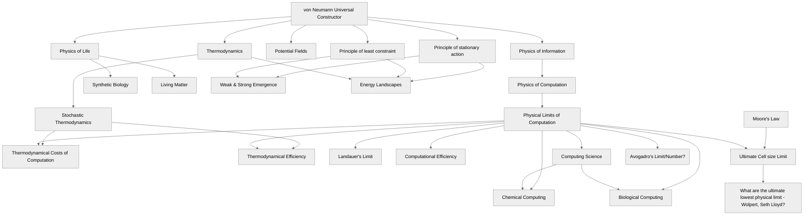

**Note:**
- Make a difference between concepts and grouped disciplines (physic of life)
- Color (define classes) the disciples, groupes, concepts
- subgraphs pg 186

```mermaid
%%{init:{"theme":"neutral"}}%%
flowchart TB
    A1[von Neumann Universal Constructor] --> A2[Physics of Information] & A3[Physics of Life] & A4[Potential Fields]
    A2[Physics of Information] --> A5[Physics of Computation]
    A1 --> A6[Principle of stationary action] & A7[Principle of least constraint]
    A1 --> A13[Thermodynamics]
    A3 --> A9[Synthetic Biology]
    A3 --> A10[Living Matter]
    A6 & A7 --> A11[Weak & Strong Emergence] & A12[Energy Landscapes]
    A13 --> A12
    A13 --> A14[Stochastic Thermodynamics]
    A14 --> A15[Thermodynamical Costs of Computation] & A16[Thermodynamical Efficiency]
    A17[Physical Limits of Computation] --> A16 & A15
    A17 --> A18[Landauer's Limit]
    A17 --> A19[Computational Efficiency]
    A5 --> A17
    A17 --> A20[Computing Science] & A21 & A22
    A20 --> A21[Chemical Computing]
    A20 --> A22[Biological Computing]
    A23[Moore's Law] --> A25[Ultimate Cell size Limit] --> A24[What are the ultimate lowest physical limit - Wolpert, Seth Lloyd?]
    A17 --> A26(Avogadro's Limit/Number?)
    A17 --> A25

```
