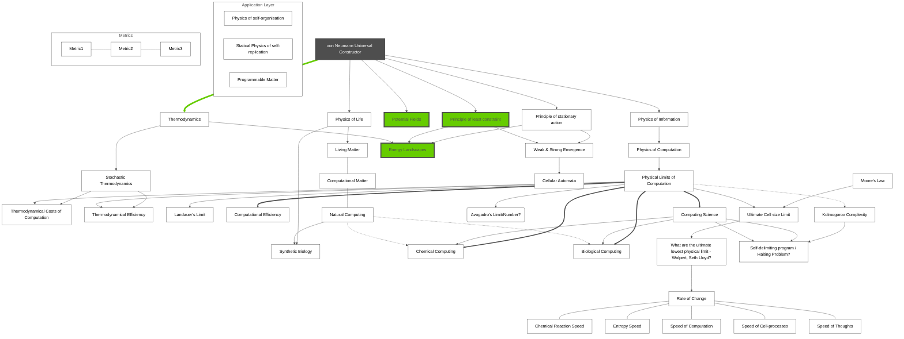
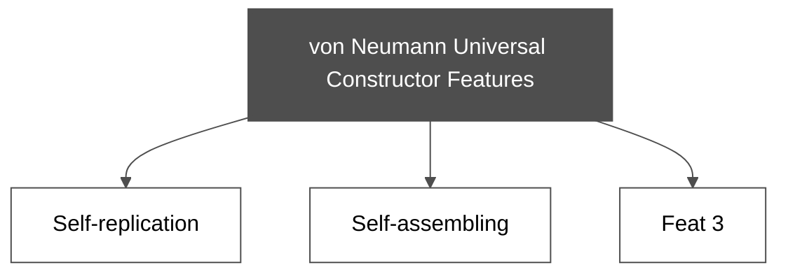
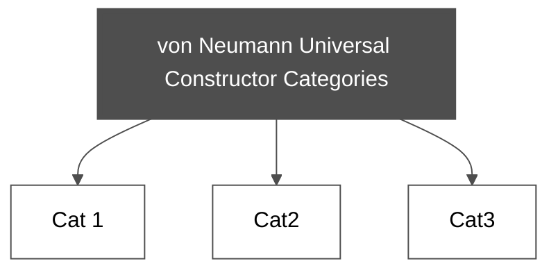

**Note:**
- Make a difference between concepts and grouped disciplines (physic of life)
- Color (define classes) the disciples, groupes, concepts
- subgraphs pg 186
- Edge color
- Node color
- Subgraph color

# Universal Constructor Categories
Note:
- Definition of "Universal Constructor
- Is "self-replication a feature of Universal Constructor?"
- UC categories or self-replication?
-

#

