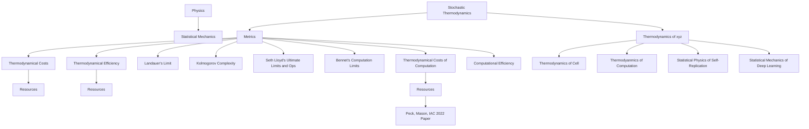

# Stochastic Thermodynamics Hack.md version

```mermaid
flowchart TB
A1[Physics] --> A2[Statistical Mechanics]

A10[Stochastic Thermodynamics] --> A11[Metrics]
A11 --> A12[Thermodynamical Costs] & A13[Thermodynamical Efficiency] & A14[Landauer's Limit] & A15[Kolmogorov Complexity] & A16[Seth Lloyd's Ultimate Limits and Ops] & A17[Bennet's Computation Limits] & A21[Thermodynamical Costs of Computation] & A23[Computational Efficiency]
A12 --> A12A[Resources]
A13 --> A13A[Resources]
%% Add resources/papers to all
A10 --> A18[Thermodynamics of xyz] --> A19[Thermodynamics of Cell] & A20[Thermodyanmics of Computation] & A25[Statistical Physics of Self-Replication] & A24[Statistical Mechanics of Deep Learning]
A21 --> A22[Resources] --> A22A[Peck, Mason, IAC 2022 Paper]

```

#Thermodynamical Costs

            

