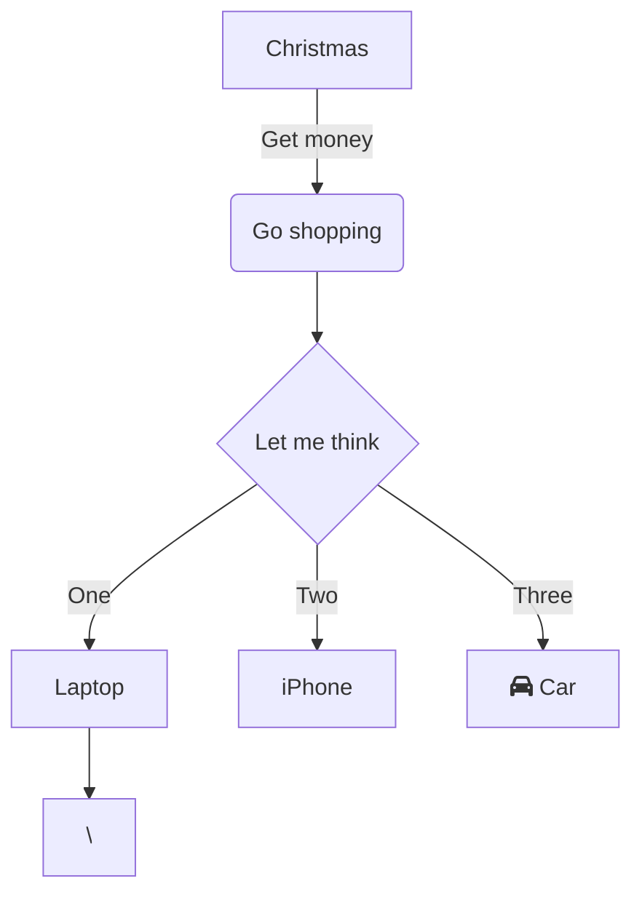

test

Open_Research_Tutorial_Matthias

## Software Setup
### Mac OS
- Markdown Word Processor *Atom*
  - [Tutorial](https://www.portent.com/blog/content/atom-markdown.htm)
  - (In-app) Packages:
    - Language Markdown
    - Markdown Writer
    - Markdown Preview
- Github Desktop
- Anaconda / Jupyter Notebook

### Ipad
- [Tutorial](https://thesweetsetup.com/ulysses-collaborate-writing/#setting-up-ulysses-on-iosipados)
- Github App
- Working Copy
- Juno (Jupyter Notebook for iOS)
- Markdown Word Processor

## Setup Open Research Project

#### Project File Structure at Github
1. Organisation
  2. Research Paper (=Repository)
    3. Branches

       **4. Master Branch = final Branch**

         - readme.md
         - Abstract
         - Intro
         - Data
         - Metrics
           - Jupyter Notebooks
         - Conclusion
         - Visualisations
         - Tables
         - Bibliography
         - Graphs (Mermaid and/or d3js)
         - Website (like Escape Summer School)

         

         For each chapter/section a dedicated branch?
         

#### Best Practices: Project File Structure
- Automatic Paper Generation
- Jupyter2pdf | Jupyter2Latex

## Todo List von Neumann Project
- Add Open Science Principles / Open Access / Reproducable Science Principles
- Research Guidlines
  - Master Branch = final, functional branch
  - Collaboration code of conduct
  -

- Automatic Paper Generation

## Coach and Preview
- Find Coach
- Open Peer Review

## Marketing Communication
- Doi Number
- Research Gate
- Arxiv Preprint
- Github
- Github Website
- Github -> Zenodo/Figshare
- Open Notebooks
- **Create a Poster (Latex)**
- Harvard Ads
- Cambridge Distribution Server
- Conferences we could present the paper (poster sessions)
- Youtube Video of the presentation (Zoom session)

- Mybinder.org
  -> generates Docker image

  # Build a book
  Follow the instructions found
  1) [Here](https://github.com/alan-turing-institute/the-turing-way/tree/main/book)
  2) [Then here](https://jupyterbook.org/en/stable/advanced/pdf.html)

[See also](#Software-Setup)
